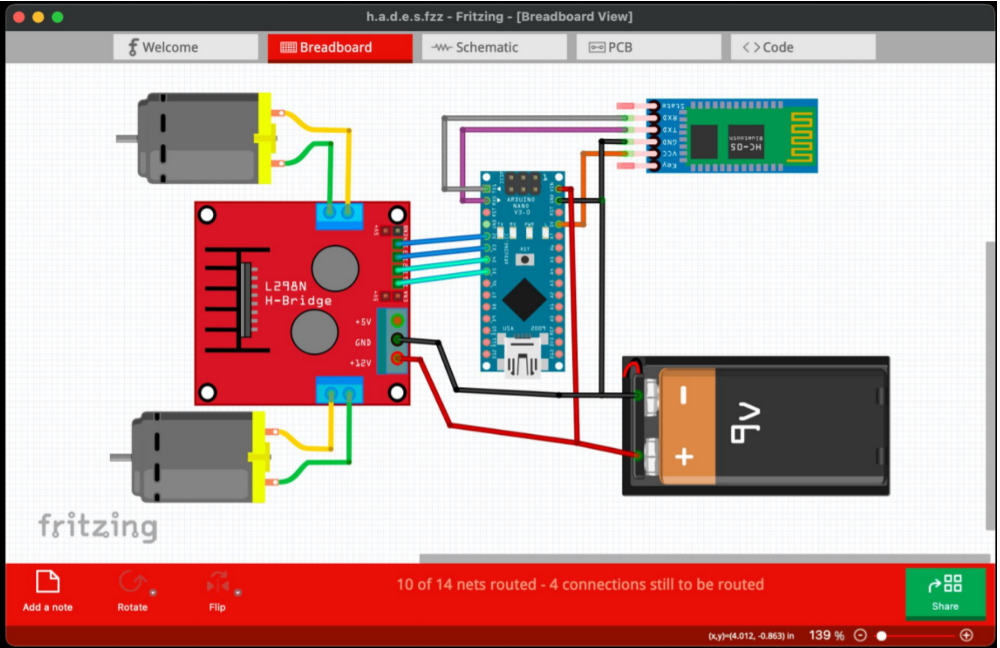
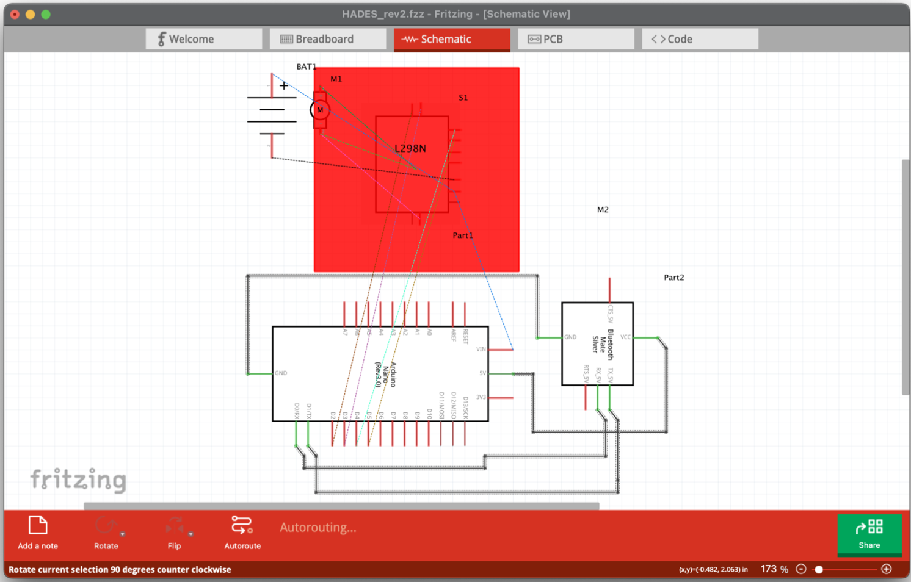
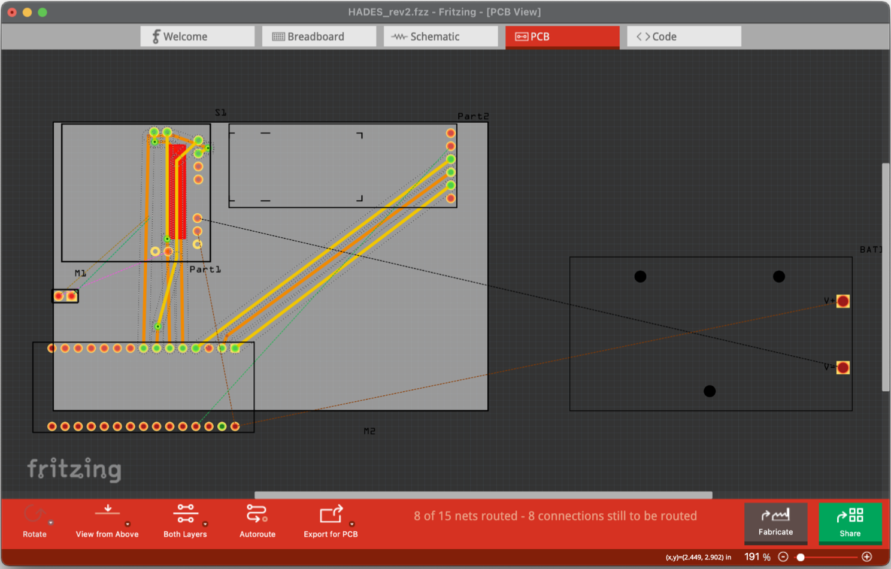

# VC-Robotic-Car
Voice Controlled Robotic Car that moves around according to the set of instructions given; done as an inclusive part of the Fall '21 Project component in Robotics (CSE1022).

- ## Abstract

Robotic assistants reduce the manual efforts being put by humans in their day-to-day tasks. The aim of our project is to make a Voice Control Robot Car. The working is based on an Arduino microcontroller, motor drivers and a Bluetooth module. The human voice commands are taken by the robot by the smartphone with which it's connected through the inbuilt microphone. This robot can perform different movements, turns, and other operations. 

We can further develop our robot and implement activities like relocating an object from one place to another and we can also try to implement a conversation with humans. The voice commands are processed in real-time, using an offline server. The speech signal commands converted to text form and are communicated to the robot over a Bluetooth network. The idea is to first design the hardware of the robot car and then code the entire working using our previous knowledge of programming. The code will then be simulated on software (IDE) and later be interfaced with the hardware. 

The coordination of the control unit with Bluetooth gadget is accomplished utilizing a Bluetooth module to catch and read the voice orders. Performance evaluation is carried out with encouraging results of the initial experiments. Possible improvements are also discussed towards potential applications in home, hospitals, car systems and industries. 

We picked this as our project as robotics has become a major part of our everyday lifestyle and also has a wide scope in the engineering field. Robotics play a vital role in the development of new technology.

- ## Design & Diagram

We have made our circuit diagram of our model through Fritzing Software. Fritzing is an open-source initiative to develop and simulate the design for the electronics hardware.

- ## Workings & Understandings

The following are the pictures taken while the robot is in action. The robot has two sections for voice recognition and synthesis. The upper part as you can see consists of a small microphone and Arduino Duo. The lower deck consists of Arduino Uno, motor drivers, and dc motors.

